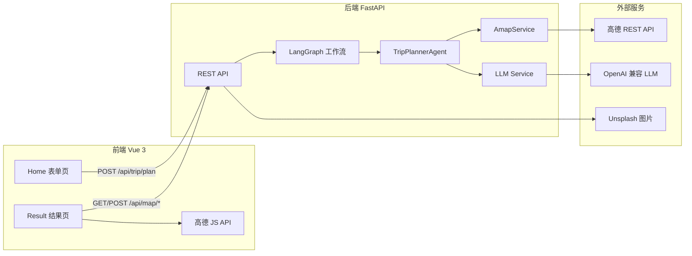
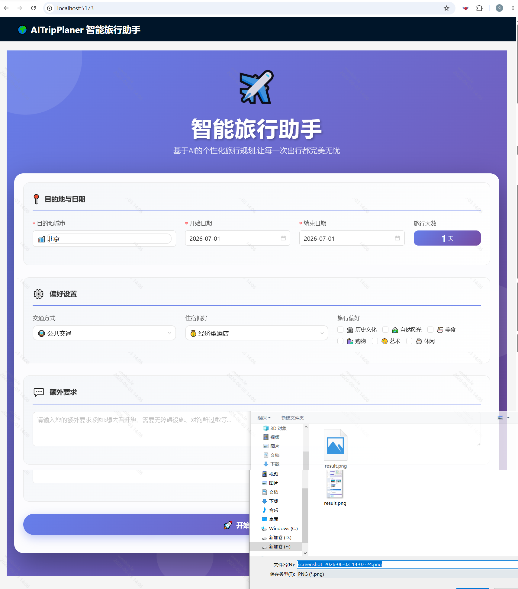
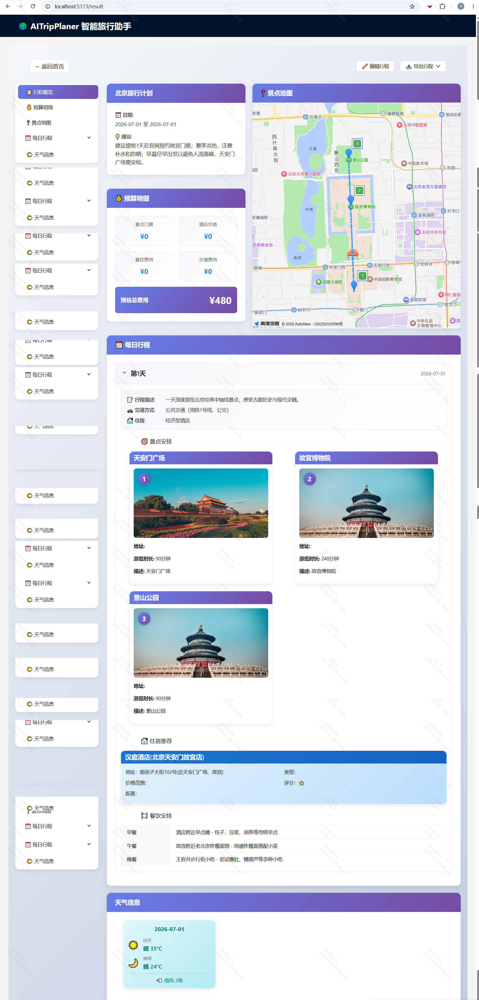

# AITripPlaner 智能旅行助手

> 输入目的地与偏好，结合高德真实 POI / 天气数据与 LLM 推理，一键生成可地图可视化的每日行程。

| 属性 | 说明 |
|------|------|
| **文档版本** | v1.1 |
| **文档类型** | 产品全流程文档（发现 → 需求 → 设计 → PRD → 开发 → 运维） |
| **适用读者** | 产品、设计、前后端开发、测试 |
| **当前阶段** | M5 优化迭代（核心闭环已打通） |

---

## 目录

- [产品概览](#产品概览)
- [界面预览](#界面预览)
- [1. 发现与调研](#1-发现与调研)
- [2. 需求定义](#2-需求定义)
- [3. 产品设计](#3-产品设计)
- [4. PRD（产品需求文档）](#4-prd产品需求文档)
- [5. 开发与迭代](#5-开发与迭代)
- [6. 部署与运维](#6-部署与运维)
- [7. 数据指标与后续规划](#7-数据指标与后续规划)

---

## 产品概览

### 价值主张

帮助自由行用户将 **3–8 小时** 的手工攻略整理，压缩为 **≤15 秒** 的智能生成；行程基于高德真实地理数据，LLM 失败时自动降级，保证始终可用。

### 核心能力一览

| 能力 | 状态 | 说明 |
|------|------|------|
| 智能行程生成（LangGraph 工作流） | ✅ 已实现 | 采集 POI → LLM 合成 → 规则兜底 |
| 每日行程卡片（景点 / 餐饮 / 住宿） | ✅ 已实现 | 含描述、时长、预算估算 |
| 高德地图标记与路线规划 | ✅ 已实现 | 按日展示，支持步行 / 驾车 / 公交 |
| 天气展示（总览 + 每日） | ✅ 已实现 | 对接高德天气 API |
| 行程在线编辑 | ✅ 已实现 | 结果页可编辑并保存 |
| 导出 PDF / 图片 | ✅ 已实现 | html2canvas + jsPDF |
| 预算明细 | ✅ 已实现 | 景点 / 酒店 / 餐饮 / 交通分项 |
| 历史计划保存与加载 | ⏳ 未实现 | P2，规划中 |
| 用户账号体系 | ⏳ 未实现 | 后续版本 |

### 系统架构



### 界面预览

#### 首页 · 旅行需求输入

填写目的地、日期、偏好与额外要求，一键发起智能规划。



#### 结果页 · 行程展示

展示行程概览、预算明细、高德地图、每日时间线与天气信息，支持编辑与导出。



---

## 1. 发现与调研

**阶段目标**：验证问题真实性与用户 / 商业价值。

### 1.1 市场背景与问题定义

- **用户行为变化**：自由行占比持续上升，用户习惯自主规划行程，但制作一份周全的旅行攻略平均耗时 3–8 小时，涉及查景点、看天气、找酒店、排路线。
- **现有方案痛点**：
  - 论坛 / 笔记类（马蜂窝、小红书）：信息零散，整合成本高。
  - 地图工具（高德、百度）：可查 POI，但无行程串联能力。
  - 行程规划 App（穷游行程助手）：以手工拖拽为主，无智能生成。
- **核心问题**：自由行用户缺少「输入偏好即可自动生成每日行程」的高效工具，尤其在需要结合实时天气和地理可达性时。

### 1.2 用户调研摘要（推断性）

| 维度 | 结论 |
|------|------|
| **目标用户** | 25–45 岁一二线城市自由行群体，每年旅行 1–3 次 |
| **典型痛点** | 景点与酒店距离过远；偏好不匹配（如带娃却全是网红点）；天气变化导致攻略失效 |
| **核心诉求** | 快（生成快）、准（行程合理）、可看（地图可视化）、可调（生成后可修改） |

### 1.3 竞品分析

| 竞品 | 优势 | 劣势 |
|------|------|------|
| 马蜂窝 / 穷游行程助手 | 用户基数大，模板丰富 | 纯手工拖拽，无 AI 生成 |
| 小红书攻略 | 真实体验，细节丰富 | 非结构化，无法一键成行 |
| ChatGPT 直接生成 | 文本流畅 | 不含真实地理数据，易出现「幻觉酒店」 |
| 高德 / 百度地图 | 地点数据准，路网完善 | 无行程编排逻辑 |

**差异化机会**：将 LLM 推理能力与高德真实 POI / 路线 / 天气数据结合，以 LangGraph 工作流保证输出可靠，并辅以规则兜底。

---

## 2. 需求定义

**阶段目标**：明确解决范围、优先级与验收边界。

### 2.1 用户故事

| 编号 | 角色 | 需求 | 目的 |
|------|------|------|------|
| US-01 | 旅行者 | 输入目的地、日期、偏好，一键生成每日行程 | 快速获得可靠计划 |
| US-02 | 细节控 | 在地图上查看景点与酒店位置，并查询路线 | 评估行程空间合理性 |
| US-03 | 天气敏感者 | 查看出行期间天气，并在行程中显示 | 动态调整户外安排 |
| US-04 | 体验尝鲜者 | LLM 失败时仍能得到基本可用方案 | 信任系统稳定性 |
| US-05 | 预算关注者 | 查看景点 / 酒店 / 餐饮 / 交通费用汇总 | 控制旅行开支 |
| US-06 | 分享者 | 将行程导出为 PDF 或图片 | 离线查看与分享 |

### 2.2 功能清单与优先级

| 优先级 | 功能 | 对应故事 | 状态 |
|--------|------|----------|------|
| P0 | 行程生成（数据采集 + LLM 合成 + 规则兜底） | US-01 | ✅ |
| P0 | 每日行程卡片展示（景点、餐饮、住宿） | US-01 | ✅ |
| P1 | 高德地图标记与路线规划 | US-02 | ✅ |
| P1 | 天气展示（总览及每日） | US-03 | ✅ |
| P1 | 行程在线编辑 | US-01 | ✅ |
| P1 | 预算明细 | US-05 | ✅ |
| P2 | 行程导出为 PDF / 图片 | US-06 | ✅ |
| P2 | 历史计划保存与加载 | — | ⏳ |
| P3 | 用户账号与云端同步 | — | ⏳ |

### 2.3 非功能需求（性能）

| 指标 | 目标值 |
|------|--------|
| 行程生成响应时间 | ≤ 15 秒 |
| LLM 生成成功率 | ≥ 90%（兜底方案 100% 可用） |
| 地图首屏加载 | ≤ 3 秒 |
| 支持行程天数 | 1–30 天 |

---

## 3. 产品设计

**阶段目标**：定义交互流程、信息架构与关键原型要点。

### 3.1 核心用户旅程

```
[首页 Home]
  → 填写：城市 / 起止日期 / 交通 / 住宿 / 偏好标签 / 额外要求
  → 点击「开始规划我的旅行」
  → 过渡态：进度条 + 状态文案（「正在搜集景点…」「智能编排中…」）

[结果页 Result]
  → 左侧导航：行程概览 | 预算明细 | 景点地图 | 每日行程 | 天气信息
  → 主内容区：
      - 概览卡片（日期、总体建议）
      - 预算汇总（门票 / 酒店 / 餐饮 / 交通）
      - 高德地图（按日标记，InfoWindow 展示详情）
      - 每日时间线（景点 → 餐饮 → 酒店）
      - 天气面板
  → 可选操作：编辑行程 | 导出 PDF/图片 | 返回首页
```

### 3.2 界面原型关键点

> 界面参考见 [界面预览](#界面预览)。

- **输入表单**：分步卡片式布局；偏好以多选 Tag 呈现；日期联动自动计算天数；非法输入前端拦截。
- **结果页**：
  - 侧边锚点导航，支持滚动定位。
  - 行程卡片内联景点、餐饮、住宿，含描述与标签。
  - 地图标记支持 InfoWindow；可选两点查询路线。
  - 编辑模式下可修改行程内容并保存。
- **响应式**：移动端地图与卡片上下堆叠。

### 3.3 数据结构（与后端 Pydantic 模型对齐）

```typescript
interface TripPlan {
  city: string;
  start_date: string;
  end_date: string;
  days: DayPlan[];
  weather_info: WeatherInfo[];
  overall_suggestions: string;
  budget?: Budget;
}

interface DayPlan {
  date: string;
  day_index: number;
  description: string;
  transportation: string;
  accommodation: string;
  hotel?: Hotel;
  attractions: Attraction[];
  meals: Meal[];
}

interface Attraction {
  name: string;
  address: string;
  location: { longitude: number; latitude: number };
  visit_duration: number;
  description: string;
  ticket_price?: number;
}

interface Budget {
  total_attractions: number;
  total_hotels: number;
  total_meals: number;
  total_transportation: number;
  total: number;
}
```

---

## 4. PRD（产品需求文档）

> 以下为可评审、可执行的开发依据，已与当前代码实现对齐。

### 4.1 功能需求详述

#### FR-01 用户输入采集

| 字段 | 类型 | 必填 | 说明 |
|------|------|------|------|
| city | string | ✅ | 目的地城市 |
| start_date | string | ✅ | 开始日期 YYYY-MM-DD |
| end_date | string | ✅ | 结束日期 YYYY-MM-DD |
| travel_days | int | ✅ | 自动计算，1–30 |
| transportation | string | ✅ | 公共交通 / 自驾 / 步行 / 混合 |
| accommodation | string | ✅ | 经济型 / 舒适型 / 豪华酒店 / 民宿 |
| preferences | string[] | — | 历史文化、自然风光、美食等 |
| free_text_input | string | — | 额外要求自由文本 |

**校验规则**：日期不可为过去；结束日期 ≥ 开始日期；天数 ≤ 30。

#### FR-02 LangGraph 工作流

```
gather（采集数据）
  → llm_plan（LLM 合成 JSON 行程）
  → [成功] END
  → [失败] fallback（基于 POI 热度 + 就近原则生成基础行程）→ END
```

| 节点 | 职责 |
|------|------|
| `gather` | 并行调用高德 API，获取景点、酒店、天气；压缩后供 LLM 消费 |
| `llm_plan` | 组装 Prompt，调用 OpenAI 兼容 LLM，Pydantic 校验 JSON |
| `fallback` | LLM 解析失败时，基于 MCP 摘要数据生成可用行程 |

#### FR-03 行程展示

- 每日卡片：日期、描述、景点列表、餐饮（早 / 午 / 晚）、推荐酒店。
- 全局：总体建议、天气信息、预算明细。
- 景点信息含地址、坐标、游览时长、门票估算。

#### FR-04 地图交互

- 高德 JS API 2.0 加载地图，按日标记 POI。
- 调用 `POST /api/map/route` 规划步行 / 驾车 / 公交路线。
- 地图自动适配视野，使当日标记点可见。

#### FR-05 天气总览

- 展示行程期间每日白天 / 夜间天气、温度、风力。

#### FR-06 编辑与导出

- 结果页支持进入编辑模式，修改行程内容并保存（前端状态）。
- 支持导出为 PNG 图片或 PDF 文档（含地图快照）。

### 4.2 非功能需求

| 类别 | 要求 |
|------|------|
| **安全** | API Key 仅存于 `.env`，前端不可见；输入防 XSS |
| **可维护性** | 后端模块化（agents / services / models / api）；前端 TypeScript 类型覆盖 |
| **可扩展性** | LLM 提供商可通过 `.env` 切换；地图服务可替换 |
| **可观测性** | 控制台记录生成耗时、LLM 成功 / 失败、高德 API 调用 |

### 4.3 API 端点定义

| 方法 | 路径 | 描述 |
|------|------|------|
| POST | `/api/trip/plan` | 生成旅行计划 |
| GET | `/api/trip/health` | 旅行规划服务健康检查 |
| GET | `/api/map/poi` | 搜索 POI（keywords, city） |
| GET | `/api/map/weather` | 查询城市天气 |
| POST | `/api/map/route` | 规划两点路线 |
| GET | `/api/map/health` | 地图服务健康检查 |
| GET | `/api/poi/detail/{poi_id}` | 获取 POI 详情 |
| GET | `/api/poi/search` | POI 关键词搜索 |
| GET | `/api/poi/photo` | 从 Unsplash 获取景点图片 |
| GET | `/health` | 全局健康检查 |
| GET | `/docs` | Swagger API 文档 |

**生成行程请求示例**：

```json
{
  "city": "北京",
  "start_date": "2026-06-01",
  "end_date": "2026-06-03",
  "travel_days": 3,
  "transportation": "公共交通",
  "accommodation": "经济型酒店",
  "preferences": ["历史文化", "美食"],
  "free_text_input": "希望多安排一些博物馆"
}
```

### 4.4 验收标准

- [x] 输入错误时前端有明确提示，不允许提交非法值
- [x] 10 天内行程均能成功生成，JSON 结构与 schema 一致
- [x] LLM 超时或解析失败后，系统自动进入兜底方案并返回可用行程
- [x] 地图标记点与返回数据坐标一致，路线查询返回合理距离和时间
- [x] 页面在 375px 宽度下无横向滚动条，布局正常
- [x] 支持导出 PDF / 图片
- [ ] 历史计划可持久化保存与加载（P2，待实现）

### 4.5 技术栈与项目结构

**技术栈**

| 层级 | 技术 |
|------|------|
| 后端 | Python 3.10+、FastAPI、LangGraph、LangChain、Pydantic |
| 前端 | Vue 3、TypeScript、Vite、Ant Design Vue、Axios |
| 地图 | 高德 REST API（后端）、高德 JS API 2.0（前端） |
| LLM | OpenAI 兼容接口（支持 Ollama 本地部署） |
| 图片 | Unsplash API（景点配图，可选） |

**目录结构**

```
AITripPlaner/
├── backend/
│   ├── app/
│   │   ├── agents/          # TripPlannerAgent 行程规划逻辑
│   │   ├── api/
│   │   │   ├── main.py      # FastAPI 入口
│   │   │   └── routes/      # trip / map / poi 路由
│   │   ├── core/            # LLM 核心配置
│   │   ├── graph/           # LangGraph 工作流定义
│   │   ├── models/          # Pydantic 数据模型
│   │   └── services/        # 高德、LLM、Unsplash 服务
│   ├── .env.example
│   ├── requirements.txt
│   └── run.py               # 启动脚本
└── frontend/
    ├── src/
    │   ├── views/
    │   │   ├── Home.vue     # 输入表单页
    │   │   └── Result.vue   # 结果展示页
    │   ├── services/api.ts  # API 封装
    │   └── types/index.ts   # TypeScript 类型
    ├── .env.example
    └── package.json
```

---

## 5. 开发与迭代

### 5.1 里程碑进度

| 里程碑 | 完成内容 | 状态 |
|--------|----------|------|
| M1 | 后端工作流与基础 API 调通 | ✅ 已完成 |
| M2 | 前后端联调，核心生成闭环 | ✅ 已完成 |
| M3 | 前端结果页与地图集成 | ✅ 已完成 |
| M4 | 异常处理与兜底方案 | ✅ 已完成 |
| M5 | 编辑 / 导出 / 预算 / 文档完善 | 🔄 进行中 |
| M6 | 历史计划持久化、性能优化 | ⏳ 待启动 |

### 5.2 风险与应对

| 风险 | 影响 | 应对策略 | 状态 |
|------|------|----------|------|
| LLM 输出格式不稳定 | 生成失败 | 强化 Prompt + Pydantic 校验 + fallback 节点 | ✅ 已实施 |
| 高德 API 限流 | 数据采集失败 | 本地缓存常用城市数据；限流时提示用户稍后重试 | 🔄 部分实施 |
| 长行程（>7 天）生成慢 | 用户体验差 | 拆分多批调用或流式返回 | ⏳ 待优化 |
| 前端导出含地图时体积大 | 导出慢 | 地图转静态快照后再渲染 | ✅ 已实施 |

---

## 6. 部署与运维

### 6.1 环境要求

- Python 3.10+
- Node.js 18+
- 高德地图 Web 服务 Key + JS API Key
- OpenAI 兼容 LLM 服务（或本地 Ollama）

### 6.2 快速启动

**1. 后端**

```bash
cd backend
python -m venv venv
# Windows
venv\Scripts\activate
# macOS / Linux
source venv/bin/activate

pip install -r requirements.txt
cp .env.example .env
# 编辑 .env，填入 LLM 与高德 API Key

python run.py
# 服务运行于 http://localhost:8000
# API 文档：http://localhost:8000/docs
```

**2. 前端**

```bash
cd frontend
npm install
cp .env.example .env
# 编辑 .env，填入 VITE_API_BASE_URL 与高德 JS Key

npm run dev
# 访问 http://localhost:5173
```


## 7. 数据指标与后续规划

### 7.1 核心指标（建议追踪）

| 指标 | 定义 | 目标 |
|------|------|------|
| 生成成功率 | 成功返回 TripPlan 的请求占比 | ≥ 99% |
| LLM 直出率 | 无需 fallback 的请求占比 | ≥ 90% |
| 平均生成耗时 | 从提交到返回的 P95 延迟 | ≤ 15s |
| 导出使用率 | 导出 PDF/图片的用户占比 | 待基线 |
| 编辑使用率 | 进入编辑模式的用户占比 | 待基线 |

### 7.2 后续迭代方向

| 版本 | 方向 | 优先级 |
|------|------|--------|
| v1.2 | 历史计划本地 / 云端持久化 | P2 |
| v1.3 | 流式生成进度（SSE） | P2 |
| v1.4 | 多城市联游、跨城交通 | P3 |
| v2.0 | 用户账号、协作分享、模板市场 | P3 |

---

**文档状态**：v1.1 全流程整合版，已与当前代码实现对齐。  
**下一步行动**：完成 M5 文档与体验优化；启动 M6 历史计划持久化方案评审。
